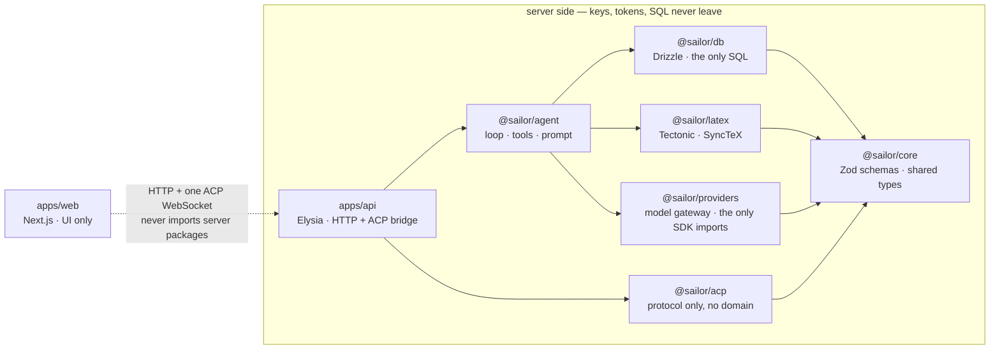

# Sailor

An agent that tailors your LaTeX resume to a real job posting — and is built so it
*can't* lie about you.

You point it at a resume and a job description. It reads both, records an honest
gap analysis, asks you for facts it's missing, and then makes small, reviewable
edits — each one shown to you as a diff, compiled before it's saved, and stored as
an immutable version you can roll back from. It rewords, reorders, cuts, and
re-emphasises. It does not invent.

## The three invariants

Everything in the codebase is downstream of these. Violating one is a bug even if
every test passes.

1. **Never invent a fact about the user.** No manufactured metrics, technologies,
   dates, titles, or employers. If a bullet would be stronger with a number the
   resume doesn't contain, the agent asks — it does not guess. A resume that lies
   is worse than a resume that is weak, because you have to defend it in an
   interview.

2. **Every edit is reversible.** Resume content is content-addressed; every agent
   turn produces a new immutable version row with a parent pointer. Nothing is
   edited in place, and a rollback is itself a new commit — so even rollback is
   reversible.

3. **The document always compiles.** Every candidate edit is compiled with
   Tectonic before it commits. A build failure rolls the edit back and hands the
   LaTeX errors to the agent to fix. A broken document is never stored.

## How a turn works

1. The browser opens an ACP session (JSON-RPC over one WebSocket) carrying the
   resume id, model reference, and job target.
2. The API resolves your model credential — your stored key or OAuth token first,
   the operator's environment key as fallback — and runs one bounded agent turn.
3. The agent gathers evidence: `read_resume` for the source, `fetch_url` /
   `web_search` for the posting. Text you pasted is labelled `pasted`; only what
   the agent fetched itself earns `fetched` trust.
4. It records a gap analysis you can see, and batches its questions to you early.
5. Every mutation goes through `edit_resume`: an exact, unique old-text match, a
   **blocking permission request with a diff in your browser** (a disconnect
   counts as deny), a full Tectonic compile, and only then a new version.

Tool failures come back to the model as structured `{ ok: false, error, hint }`
results, so a bad edit or a broken build is something the agent recovers from
mid-turn rather than something that kills the session.

## Architecture

A Bun monorepo. The dependency graph points one way, and there are no cycles:



| Package | Responsibility |
| --- | --- |
| `packages/core` | Zod schemas and dependency-free shared types. Everything crossing a process boundary is parsed here. |
| `packages/db` | Drizzle schema, migrations, queries, credential encryption. The only place SQL exists. |
| `packages/latex` | Compilation only: a semaphore-limited Tectonic pool run `--untrusted`, plus a SyncTeX reader mapping PDF points back to source lines. |
| `packages/providers` | The provider-neutral model gateway. Anthropic, OpenAI, Google, and OpenRouter drivers — SDK imports are confined to `src/drivers/`. Adding a provider never touches the agent. |
| `packages/agent` | The brain: system prompt, bounded tool loop, and the tool registry — defined once, exposed both in-process and as an MCP server. |
| `packages/acp` | Agent Client Protocol types and transport. Deliberately knows nothing about resumes. |
| `apps/api` | Thin Elysia boundary: HTTP routes, OAuth flows, the ACP bridge. Logic lives in packages. |
| `apps/web` | The editor: CodeMirror source, live PDF preview, chat. Talks to the API over the wire only — which is what keeps keys and tokens out of the client bundle. |

Two compile paths, one source of truth: the editor previews through a debounced
web worker that never flashes a blank frame, while saves, exports, and every
agent edit go through the server's Tectonic pool. If the two ever disagree, the
server is right.

More depth, kept current in `docs/`:
[architecture](docs/architecture.md) · [providers & credentials](docs/providers.md) ·
[the agent & ACP](docs/agent.md) · [LaTeX compilation](docs/latex.md)

## Running it

You need [Bun](https://bun.sh) and Docker (for Postgres).

```sh
git clone https://github.com/moKshagna-p/sailor.git
cd sailor

cp .env.example .env            # set SAILOR_ENCRYPTION_KEY; add provider keys if you have them
bun run scripts/install-tectonic.ts
bun run setup                   # install deps, start Postgres, run migrations
bun run dev                     # web on :3000, api on :3001
```

Then open http://localhost:3000, create a resume (a starter template compiles out
of the box), and connect a model in **Settings**.

If you don't already have an API key, use **Connect OpenRouter**. It needs no key
and no configuration — approve it once and Sailor receives a key of its own,
reaching Claude, GPT, and Gemini through a single connection, including two
free tool-capable models so a zero-credit account still gets a working agent.

Otherwise paste an API key for any provider. Keys are verified with the provider
before they're stored, so a typo is rejected immediately rather than discovered
mid-conversation. Two caveats worth knowing up front: connecting an Anthropic
account gives you a Claude *subscription* token, which Anthropic permits only
inside Claude Code — for Sailor you want an API key from
[console.anthropic.com](https://console.anthropic.com). And OpenAI and Google
OAuth need you to register your own OAuth app first; Settings will tell you which
variables are missing. See [docs/providers.md](docs/providers.md) for both.

### Using Sailor from Claude Code, Zed, or Cursor

The same tool registry that powers the web app is exposed over MCP, with the same
guarantees — compile-before-commit, immutable versions, no fabricated facts:

```sh
claude mcp add sailor -- bun run --cwd /path/to/sailor packages/agent/src/mcp/server.ts
```

## Development

```sh
bun run check       # Biome — zero warnings
bun run typecheck   # zero errors; `any` and `!` are lint errors, not shortcuts
bun test
```

A change isn't done when those pass — it's done when you've driven the actual
flow: compiled a real resume, run a real agent turn, clicked the real button.
The full house rules live in [AGENTS.md](AGENTS.md).

## Status

Under active development. Recent: one-click OpenRouter sign-in that needs no API
key or client registration, provider key verification, the Anthropic code-paste
OAuth flow, and a pdf.js preview you can click to land on the LaTeX that produced
what you clicked. Next up: a selection menu on the preview (jump to source / ask
the agent about this line), real multi-user auth, and a browser WASM compile
engine behind the existing worker seam.
